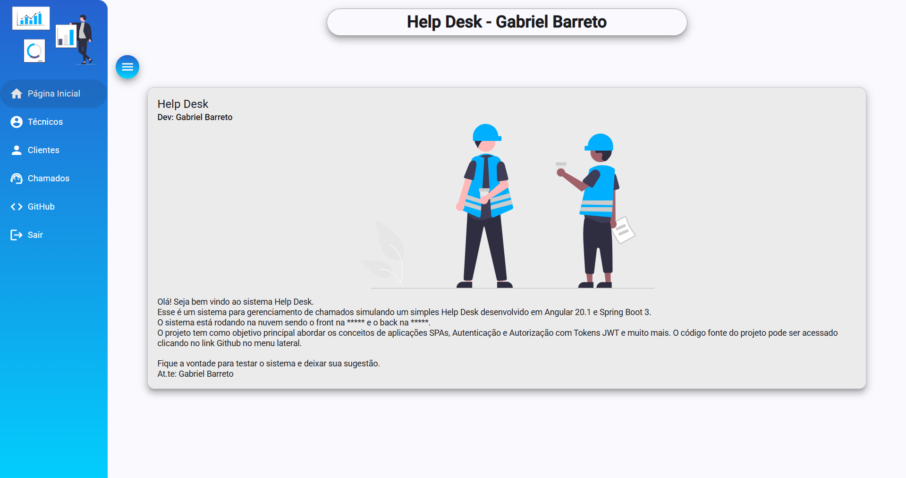
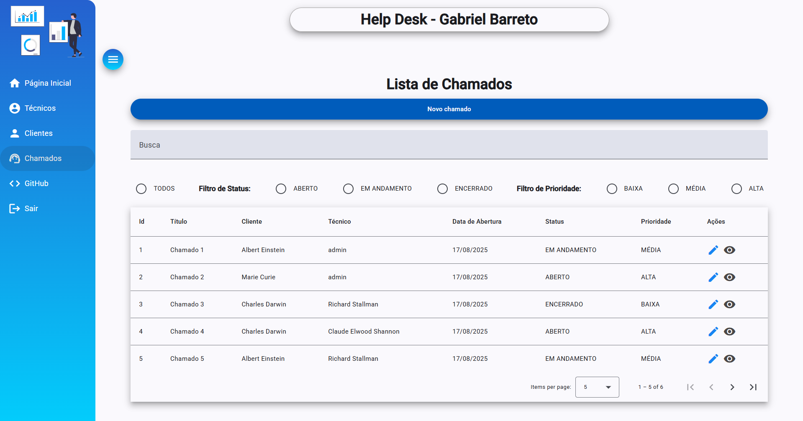

# 🛠️ Help Desk - Login System

Sistema completo de autenticação e gerenciamento de chamados, desenvolvido com **Angular** no frontend e **Spring Boot + PostgreSQL** no backend. Ideal para pequenas empresas ou times de suporte técnico que desejam gerenciar tickets de atendimento.

---

## 🚀 Tecnologias Utilizadas

### Frontend (Angular)
- Angular 20+
- Angular Material
- Google Icons 
- Reactive Forms
- TypeScript
- SCSS

### Backend (Spring Boot)
- Spring Boot 3.5+
- Spring Security
- JPA / Hibernate
- PostgreSQL
- Maven
- Docker (com multi-stage build)

---

## 🎯 Funcionalidades

- ✅ Login com autenticação JWT
- ✅ Controle de acesso por perfil (Admin / Técnico / Cliente)
- ✅ Criação e edição de usuários
- ✅ Cadastro, listagem e atualização de chamados
- ✅ Validação de formulários
- ✅ Feedbacks visuais com Angular Material
- ✅ Deploy com Docker no backend

---

## 📷 Imagens da Aplicação




---

## 🔒 Autenticação

- Autenticação baseada em **JWT (JSON Web Token)**
- Backend com Spring Security
- Roteamento protegido no Angular
- Interceptor HTTP para incluir o token nos requests

---

## 🧪 Teste Rápido (Versão de Produção)

> 🟢 **Backend Online:**  
🔗 https://helpdesk-backend-752p.onrender.com

> 🟡 **Frontend Online:**  
🔗 (link deploy)

---

## 🧱 Estrutura do Projeto

```bash
helpdesk/
├── backend/
│   ├── src/
│   └── Dockerfile
├── frontend/
│   └── src/
│   └── angular.json
└── README.md
